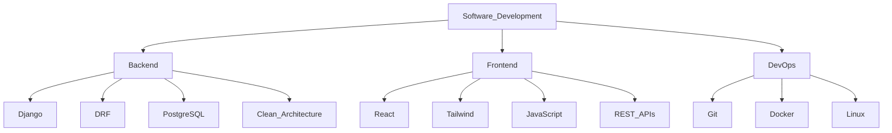

  

    
  

  
  

    
  

## 🧑🏻‍💻 Software Engineer

I build scalable, full-stack web applications using modern backend and frontend technologies. My focus is on clean architecture, RESTful design, and building reliable systems for real-world use.

- 🧱 **Backend Development** - Django, DRF, PostgreSQL, Clean Architecture, API Design
- ⚛️ **Frontend Development** - React, Tailwind CSS, reusable UI components
- 🤖 **AI Development (Learning)** - TensorFlow, OpenCV, foundational ML/AI principles
- 🧪 **Production Practices** - Testing (unit/integration), DevOps basics (Docker, Linux, Git)

Currently working on next-generation AI systems for information retrieval, autonomous agents, and knowledge management.

---

## 💡 Core Competencies

### 🧩 Backend & Web Architecture

### 🔧 Engineering & Development

  <table> <tr> <td align="center" width="100">   Python </td> <td align="center" width="100">   C++ </td> <td align="center" width="100">   Django </td> <td align="center" width="100">   React </td> <td align="center" width="100">   Tailwind </td> <td align="center" width="100">   JavaScript </td> </tr> <tr> <td align="center" width="100">   PostgreSQL </td> <td align="center" width="100">   Git </td> <td align="center" width="100">   Docker </td> <td align="center" width="100">   Linux </td> <td align="center" width="100">   OpenCV </td> <td align="center" width="100">   TensorFlow </td> </tr> </table> 

---

## 📊 Coding Stats

### 🧠 Codeforces Progress

### 🏆 LeetCode Progress

  

### 📈 GitHub Activity

---

## 🌱 Current Learning Path

- 🧠 AI Development – leveraging TensorFlow / OpenCV in real-world applications

- 🧼 Clean Architecture – scalable project structure and maintainable codebases

- ✅ Testing – improving code quality with unit & integration tests

---

## 🤝 Let's Collaborate

I'm actively seeking opportunities to collaborate on projects involving:

🧩 **Full-stack Web Applications (Django + React)** 
⚙️ **RESTful API Design** 
🧱 **Clean Architectural Patterns** 
🤖 **AI Integration in Web Systems** 
🚀 **DevOps Practices** 

  
Open to discussing challenging technical problems and interesting software projects!

